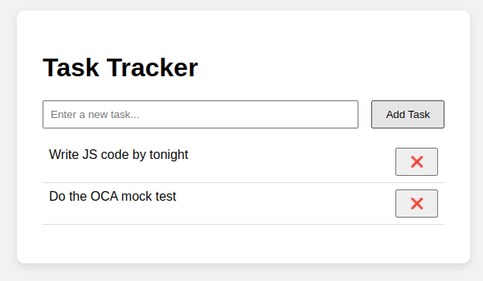

# ✅ Task Tracker App

A simple and lightweight task management application built using **React**, **TypeScript**, and **Vite**. You can add, toggle, and delete tasks — a perfect project to learn React and TypeScript fundamentals.

---

## 📸 Demo

 

---

## 🚀 Features

- ✅ Add new tasks
- 📝 Mark tasks as complete/incomplete
- ❌ Delete tasks
- ⚛️ Built using functional React components
- 🔐 Typed with TypeScript interfaces
- 💡 Clear and minimal design
- 💻 Fast and easy development with Vite

---

## 🧑‍💻 Tech Stack

- [React](https://react.dev/)
- [TypeScript](https://www.typescriptlang.org/)
- [Vite](https://vitejs.dev/) (build tool)
- CSS (or Tailwind if added)

---

## 📁 Project Structure

